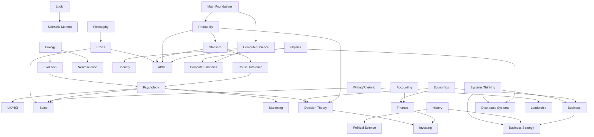

# Curriculum Graph

This file defines what should come before what.

## Recommended sequence

### Stage 0 — Orientation
Understand the whole map, define vocabulary, set up notes, and learn retrieval practice.

### Stage 1 — Reasoning substrate
1. Logic
2. Algebra and functions
3. Probability
4. Statistics
5. Scientific method and research design
6. Writing and argumentation
7. Learning science

### Stage 2 — Human foundations
1. Intro philosophy
2. Intro psychology
3. Biology and evolution
4. Microeconomics
5. Ancient/world history survey
6. Sociology/anthropology orientation

### Stage 3 — Technical foundations
1. Programming fundamentals
2. Data structures and algorithms
3. Computer architecture
4. Operating systems
5. Networking
6. Databases
7. Software engineering

### Stage 4 — Applied domains
Now branch in parallel:

- Sales + negotiation
- Marketing + growth
- Entrepreneurship + management
- Finance + investing
- UX/HCI
- Full-stack systems
- AI/ML
- Graphics/3D

### Stage 5 — Strategy and civilization
Study major leaders and wars only after enough history to avoid biography-as-history.

- Greece → Philip II → Alexander
- Roman Republic → Caesar → Augustus
- French Revolution → Napoleon
- Thucydides → Sun Tzu → Machiavelli → Clausewitz

### Stage 6 — Synthesis
Combine domains through essays, projects and comparisons rather than collecting more material.

Examples:
- Incentives in economics, organizations, evolution and politics.
- Bayesian reasoning in diagnosis, investing and product experiments.
- Feedback loops in ecology, software systems, markets and habits.
- Signaling in biology, sociology, marketing and hiring.
- Principal-agent problems in government, companies and investing.

## Domain-specific dependency chains

### Decision-making
Algebra → probability → statistics → Bayes/base rates → behavioral science → decision theory → forecasting/experimentation/investing.

### Philosophy
Logic → Greek intellectual context → Plato → Aristotle → Hellenistic schools → Stoicism → early modern philosophy → modern ethics/epistemology/philosophy of science.

### History of Alexander
Ancient Near East → Greek city states → Persian Empire → Peloponnesian aftermath → Macedonia under Philip II → Alexander → Successors.

### Caesar
Roman institutions → Punic-era expansion → social/economic stresses → Gracchi/Sulla → late-Republic politics → Caesar → civil war → assassination → Second Triumvirate → Augustus.

### Napoleon
Enlightenment/ancien régime → French Revolution → Revolutionary Wars → Napoleon's rise → Empire → coalition wars → Russia → Hundred Days → Restoration/legacy.

### Full-stack engineering
Programming → data structures → networking + OS + databases → HTTP/browser → APIs/auth → caching/queues → distributed systems → observability/reliability → system design.

### AI engineering
Linear algebra + calculus + probability → classical ML → neural networks → optimization → transformers → inference → evaluation → retrieval/RAG → agents/tool use → production AI systems.

### 3D graphics
Vectors/matrices → transformations → rasterization → lighting → shaders → geometry/topology → UVs/textures → PBR → Three.js/WebGPU/Blender → optimization → AI-assisted 3D.

## Anti-chaos rule

At any one time, keep:
- one foundational course,
- one humanities/history primary-source track,
- one applied professional track,
- one synthesis/writing project.

Do not run ten serious tracks simultaneously.